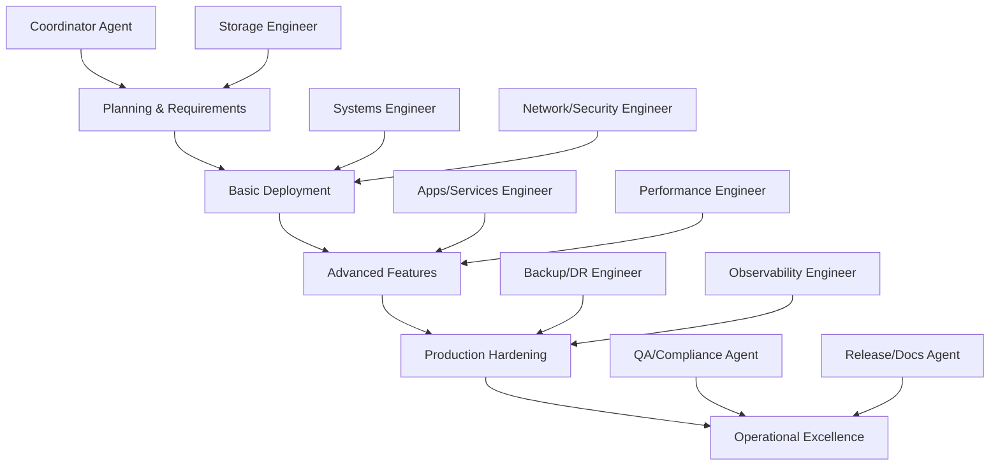

# Complete Deployment Workflow

This workflow demonstrates end-to-end deployment from planning to production using the TrueNAS framework's multi-agent approach.

## 📊 Overview

This workflow uses the [multi-agent system](../../AGENTS.md) to deploy a complete TrueNAS solution. Each phase involves different specialist agents working together to deliver a production-ready system.

## 🎯 Workflow Phases



## 🚦 Phase 1: Planning & Requirements (Coordinator Agent)

### 1.1 Requirements Gathering
Create an Architecture Decision Record (ADR) documenting:

**Basic Home Setup Requirements:**
```yaml
target_environment: home_office
users: 4-6 family_members  
capacity: 8TB_usable
performance: gigabit_network_limited
availability: single_node_acceptable
backup_strategy: 3-2-1_methodology
security_level: standard_home
budget: moderate
```

**Use the Framework:**
```bash
# Create issue from template
gh issue create --template truenas-task.yml \
  --title "Deploy Basic Home TrueNAS Setup" \
  --assignee coordinator-agent
```

### 1.2 Architecture Decisions  
The Coordinator Agent makes key decisions:
- **Platform**: TrueNAS SCALE (active development, apps ecosystem)
- **Storage**: RAIDZ1 pool (4x4TB drives, 1-drive fault tolerance)  
- **Networking**: Single NIC, VPN for remote admin
- **Backup**: Local snapshots + cloud replication
- **Security**: Firewall, SSH keys, no public web UI

### 1.3 Agent Assignment
```yaml
phase_1_agents:
  - coordinator: overall_orchestration
  - storage: pool_and_dataset_design  
  - systems: boot_and_os_configuration
  - network_security: access_control_and_hardening
```

## 🏗️ Phase 2: Basic Deployment

### 2.1 Systems Engineer: Boot and Base OS
**Responsibilities**: Hardware setup, TrueNAS installation, user management

**Deliverables:**
```bash
examples/basic-home-setup/
├── ansible/
│   ├── bootstrap.yml        # User setup, SSH hardening
│   └── inventory/hosts      # Target system configuration  
└── specs/
    └── users-groups/family.yaml  # User and group definitions
```

**Execution:**
```bash
# Deploy base system configuration
ansible-playbook -i ansible/inventory/hosts ansible/bootstrap.yml

# Validate base system
ssh john@192.168.1.100 "systemctl status"
```

### 2.2 Storage Engineer: Pool and Dataset Design  
**Responsibilities**: ZFS pool topology, dataset hierarchy, performance tuning

**Deliverables:**  
```bash
specs/
├── pools/home-pool.yaml     # RAIDZ1 configuration  
└── datasets/family-data.yaml # Dataset hierarchy with ACLs
```

**Key Decisions:**
- **Pool Type**: RAIDZ1 (3+1 parity, good capacity/performance balance)
- **ashift**: 12 (4K sectors for modern drives)
- **Compression**: LZ4 (fast with good ratio)
- **Recordsize**: Tuned per workload (128K default, 1M for media)

### 2.3 Network/Security Engineer: Access Control
**Responsibilities**: Network configuration, firewall, VPN readiness

**Deliverables:**
```bash
specs/
├── network/home-network.yaml   # Network and firewall config
└── shares/family-shares.yaml   # SMB/NFS share definitions  
```

**Security Implementation:**
- UFW firewall with local network access only
- SSH key-based authentication  
- SMB/NFS shares with proper ACLs
- VPN-ready configuration for remote admin

## ⚙️ Phase 3: Storage Provisioning (Storage + Performance Engineers)

### 3.1 Deploy Storage Configuration
```bash
# Create ZFS pool and datasets
ansible-playbook -i ansible/inventory/hosts ansible/provision.yml

# Verify pool health
ssh john@192.168.1.100 "sudo zpool status tank"

# Check dataset layout
ssh john@192.168.1.100 "sudo zfs list -r tank"
```

### 3.2 Performance Validation
The Performance Engineer validates the storage configuration:

```bash
# Test sequential I/O
ssh john@192.168.1.100 "sudo fio --name=seq-write --ioengine=libaio --rw=write --bs=1M --size=1G --filename=/mnt/tank/fio-test"

# Test random I/O  
ssh john@192.168.1.100 "sudo fio --name=rand-rw --ioengine=libaio --rw=randrw --bs=4k --size=1G --filename=/mnt/tank/fio-test"

# Network throughput
iperf3 -c 192.168.1.100 -t 60
```

### 3.3 Performance Tuning
Based on results, apply optimizations:
```bash
# ARC tuning (adjust for available RAM)
echo "options zfs zfs_arc_max=$((8 * 1024 * 1024 * 1024))" | sudo tee -a /etc/modprobe.d/zfs.conf

# Network optimizations  
echo 'net.core.rmem_max = 134217728' | sudo tee -a /etc/sysctl.conf
```

## 🔧 Phase 4: Services and Applications (Apps/Services Engineer)

### 4.1 Core Services Configuration
Deploy essential services:

```bash
# SMB/CIFS for Windows/Mac
systemctl enable --now smbd nmbd

# NFS for Linux clients  
systemctl enable --now nfs-server

# SSH with security hardening
systemctl enable --now ssh
```

### 4.2 Application Readiness
Prepare for common home applications:

**Nextcloud Setup:**
```bash
# Create app dataset
sudo zfs create tank/apps/nextcloud
sudo chown nextcloud:apps /mnt/tank/apps/nextcloud  

# Install Nextcloud (example)
# (Actual installation varies by method)
```

**Plex Media Server:**
```bash  
# Create media app dataset
sudo zfs create tank/apps/plex
sudo chown plex:apps /mnt/tank/apps/plex

# Link to media share
sudo ln -s /mnt/tank/shared/media /mnt/tank/apps/plex/media
```

## 🛡️ Phase 5: Backup Strategy (Backup/DR Engineer)

### 5.1 Implement Backup Configuration
**Deliverables:**
```bash
specs/backup/home-backup.yaml  # Comprehensive backup strategy
```

**Implementation:**
```bash
# Configure automatic snapshots
sudo systemctl enable --now zfs-auto-snapshot.timer

# Set up cloud backup (Backblaze B2 example)
rclone config create b2-backup b2 account <account> key <key>

# Schedule cloud sync
echo "0 6 * * * rclone sync /mnt/tank/home b2-backup:truenas-home-backup/home --log-file /var/log/backup.log" | sudo crontab -
```

### 5.2 Backup Validation  
```bash
# Test backup functionality
./tests/verify-backup.sh --host 192.168.1.100

# Verify 3-2-1 methodology:
# 3 copies: original + local snapshots + cloud backup  
# 2 media: local ZFS + cloud storage
# 1 offsite: cloud backup
```

## 📊 Phase 6: Monitoring & Observability (Observability Engineer)

### 6.1 Monitoring Implementation
**Deliverables:**
```bash
specs/monitoring/home-monitoring.yaml  # Complete monitoring setup
```

**Key Monitoring Areas:**
- **System Health**: CPU, RAM, temperature
- **Storage Health**: SMART, pool status, capacity  
- **Network**: Interface status, connectivity
- **Services**: SMB, NFS, SSH availability
- **Security**: Failed logins, unusual access

### 6.2 Alerting Configuration
```bash
# Configure email alerts
sudo postconf -e 'relayhost = [smtp.gmail.com]:587'
sudo postconf -e 'smtp_use_tls = yes'

# Test alerting
echo "Test alert from TrueNAS" | mail -s "System Test" admin@home.local
```

### 6.3 Dashboard Setup
- Configure TrueNAS built-in dashboard
- Set up key performance indicators (KPIs)
- Create status overview for non-technical family members

## ✅ Phase 7: Quality Assurance (QA/Compliance Agent)

### 7.1 Comprehensive Validation
```bash  
# Run full deployment validation
./tests/validate-deployment.sh --host 192.168.1.100 --user john

# Check compliance with security policies
# - No internet-facing web UI ✓
# - SSH key-only authentication ✓  
# - Firewall configured ✓
# - Backup strategy implemented ✓
```

### 7.2 Policy Validation
Ensure deployment meets framework standards:
```yaml
security_compliance:
  web_ui_exposure: vpn_only ✓
  backup_strategy: 3-2-1 ✓  
  admin_access: ssh_key_only ✓
  user_separation: proper_acls ✓
  
operational_compliance:
  monitoring: comprehensive ✓
  maintenance: automated ✓  
  documentation: complete ✓
  testing: validated ✓
```

### 7.3 Load Testing
```bash
# Simulate concurrent family usage
for user in john susan alice bob; do
  # Simultaneous file operations
  ssh ${user}@192.168.1.100 "dd if=/dev/zero of=/mnt/tank/home/${user}/test-$(date +%s).dat bs=1M count=100" &
done

# Monitor system performance during load
ssh john@192.168.1.100 "iostat -x 1"
```

## 📚 Phase 8: Documentation & Release (Release/Docs Agent)

### 8.1 Complete Documentation
**Deliverables:**
```bash
examples/basic-home-setup/
├── README.md                    # Overview and quick start
├── docs/
│   ├── deployment-guide.md      # Step-by-step deployment  
│   ├── user-guide.md           # End-user documentation
│   └── maintenance.md          # Operational procedures
└── tests/
    ├── validate-deployment.sh   # System validation
    └── verify-backup.sh        # Backup verification
```

### 8.2 User Training Materials
Create guides for different family member roles:
- **Admin (John)**: Full system management  
- **Power User (Susan)**: Share management, basic troubleshooting
- **Standard Users (Alice, Bob)**: File access, basic usage
- **Guest**: Read-only access to public areas

### 8.3 Operational Runbooks  
Document common procedures:
```bash
docs/runbooks/
├── backup-restore.md      # Backup and restore procedures
├── disk-replacement.md    # How to replace failed drives  
├── user-management.md     # Adding/removing users
└── troubleshooting.md     # Common issues and solutions
```

## 🎯 Phase 9: Production Go-Live

### 9.1 Final Validation Checklist
```bash
# System health
[ ] All drives healthy, no SMART errors
[ ] Pool status ONLINE, no errors  
[ ] System performance acceptable
[ ] Network connectivity stable

# Security  
[ ] Firewall active and properly configured
[ ] SSH access working with keys only
[ ] User permissions tested
[ ] No internet-facing services  

# Backup
[ ] Automatic snapshots working
[ ] Cloud backup tested  
[ ] Restore procedures validated
[ ] 3-2-1 methodology confirmed

# Monitoring
[ ] Email alerts configured and tested
[ ] All monitoring agents active  
[ ] Dashboard accessible
[ ] Performance baseline established

# Documentation
[ ] All procedures documented
[ ] User guides created
[ ] Emergency procedures available
[ ] Maintenance schedule defined
```

### 9.2 Go-Live Communication  
```bash
# Notify family members
# Provide access information
# Schedule training sessions
# Establish support procedures
```

## 🔄 Phase 10: Ongoing Operations

### 10.1 Maintenance Schedule
```yaml
daily_automated:
  - smart_short_tests
  - snapshot_creation
  - health_monitoring
  - log_collection

weekly_automated:  
  - smart_long_tests
  - backup_verification
  - security_scanning
  - capacity_monitoring

monthly_manual:
  - pool_scrub_review
  - capacity_planning
  - user_access_review  
  - backup_restore_testing

quarterly_manual:
  - full_system_review
  - hardware_health_check
  - software_updates
  - disaster_recovery_testing
```

### 10.2 Continuous Improvement
- Monitor performance trends
- Optimize based on usage patterns  
- Plan capacity expansion
- Evaluate new features and applications

## 🎉 Success Metrics

### Technical Metrics
- **Uptime**: >99.5% (allowing for planned maintenance)
- **Performance**: Network throughput >800 Mbps
- **Capacity**: <70% pool utilization  
- **Backup RPO**: <1 hour data loss
- **Recovery RTO**: <4 hours to restore service

### User Satisfaction  
- **Ease of Access**: Family members can access files easily
- **Performance**: No complaints about slow access
- **Reliability**: No unplanned outages affecting daily use
- **Security**: No security incidents or breaches

## 📊 Lessons Learned & Best Practices

### What Worked Well  
✅ **Multi-Agent Approach**: Clear separation of concerns and expertise  
✅ **Infrastructure as Code**: Repeatable, version-controlled configuration  
✅ **Comprehensive Testing**: Validation scripts caught issues early  
✅ **Staged Deployment**: Incremental rollout reduced risk  
✅ **Documentation**: Thorough docs enabled self-service support  

### Areas for Improvement
⚠️ **Performance Testing**: More thorough load testing needed  
⚠️ **User Training**: More hands-on training sessions required  
⚠️ **Backup Testing**: More frequent restore drills needed  
⚠️ **Monitoring**: More proactive alerting required  

### Recommendations for Next Deployment
1. **Start Simple**: Begin with basic config, add complexity gradually  
2. **Test Everything**: Validate each component before proceeding  
3. **Document Early**: Create docs as you go, not after  
4. **Plan for Growth**: Design with future expansion in mind  
5. **Involve Users**: Include end users in planning and testing  

## 🚀 Next Steps: Advanced Features  

After successful basic deployment, consider:

### Performance Enhancements
- L2ARC cache drives for frequently accessed data
- SLOG devices for sync-intensive workloads  
- Network link aggregation for higher throughput

### High Availability
- Second TrueNAS node for failover
- Shared storage for clustering  
- Load balancing for services

### Advanced Applications
- Kubernetes cluster on TrueNAS SCALE
- Advanced backup solutions  
- Media streaming optimization
- Home automation integration

### Enterprise Features  
- Active Directory integration
- Advanced monitoring with Grafana
- Automated disaster recovery
- Compliance reporting

---

This workflow demonstrates how the multi-agent framework enables systematic, reliable deployment of TrueNAS systems from basic home setups to advanced enterprise configurations.